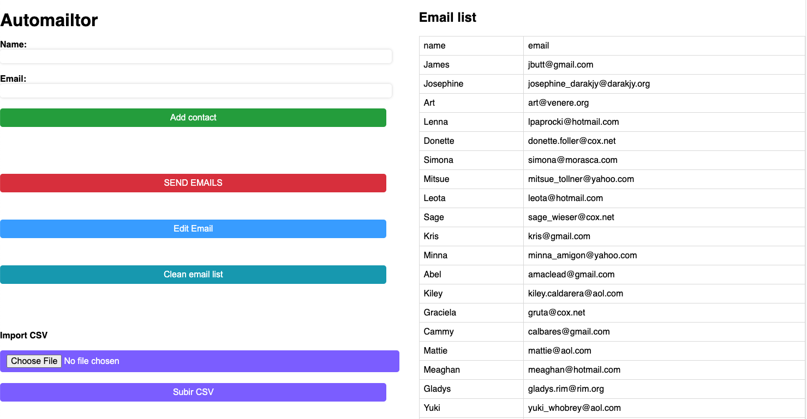
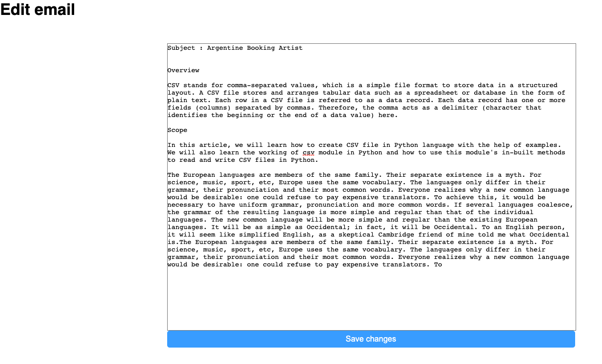

# Automailtor

Flask email automation app.

## Description

`Automailtor` is a way to send automated messages to the right people at the right time using a marketing automation tool. The benefits of email automation include personalized customer experiences, optimized marketing team efficiency, improved customer retention rates, and scalability of marketing strategies. Automated emails can be used to fill a customer's needs, making it more likely for them to return to your business.

## Features

- Email list automation
- Name - Email user input
- Use Name field to change the email text
- Email text editor
- Import custom CSV file
- Archive past email lists (csv)

## Screenshots





## How to run

```bash
mkdir automailtor
git clone https://github.com/ezequielabregu/automailtor.git
cd automailtor
```

**Create your App Password**

For security reasons, the username and password must be provided by you.

1. Go to your Google Account.
2. Select Security.
3. Under "Signing in to Google," select App Passwords. You may need to sign in. If you don’t have this option, it might be because:
   1. Step Verification is not set up for your account.
   2. Step Verification is only set up for security keys
   3. Your account is through work, school, or other organization.
   4. You turned on Advanced Protection.

Create a credentials.py file:

```bash
nano credentials.py
```

with the following content

```bash
sender = "your-email"
password = "your-google-password-app" 
```

Run the app:

```bash
python app.py
```

Web browser address:

`127.0.0.1:5000`
